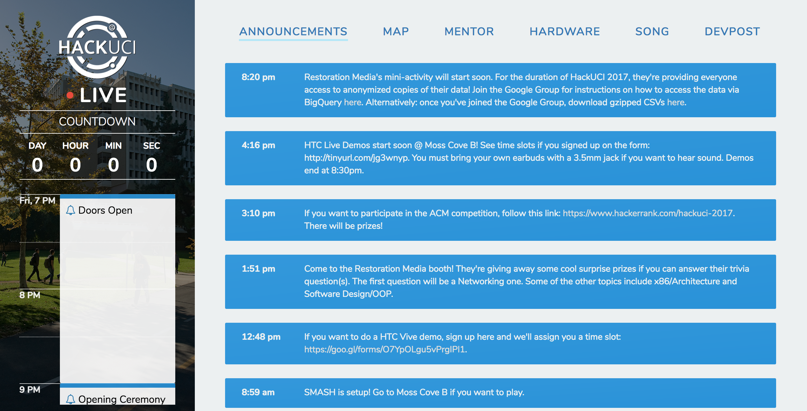
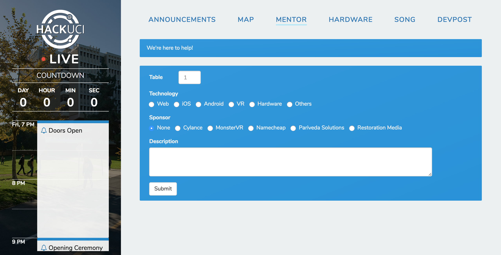
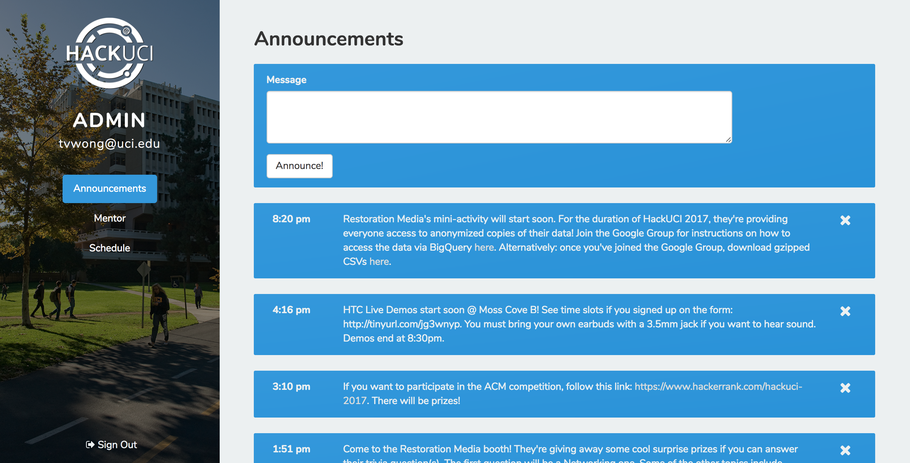

# HackUCI Live

## Introduction
A good hackathon is not just about the venue, prizes or food, but also the experience itself. However, it is not easy to provide a consistent experience among 400 attendees, and having a website that allows hackathon participants to interact with the organizers seamlessly can provide a tremendous boost to the overall hackathon experience.

## What It Does
HackUCI Live contains two main components — a site for participants and an admin panel.

The site for participants, aka the “main site”, acts as a communication portal between participants and organizers. It contains information, such as a schedule, a real-time announcement system and a mentor request system, that is vital for the hackathon to proceed smoothly.

The admin panel, on the other hand, provides organizers and mentors a way to make announcements and attend to mentor requests. It also contains a fail-safe mechanism that allows administrators to force reload the webpage on every client’s computer in the event of an update.

## Technology
We built the site using Twitter’s Bootstrap framework and jQuery. We used Firebase as a real-time database that streams information from the admin panel to the main site and vice versa.

## Demo
Check out our live demo (pun intended) at [http://live.hackuci.com](http://live.hackuci.com).

## Screenshots

